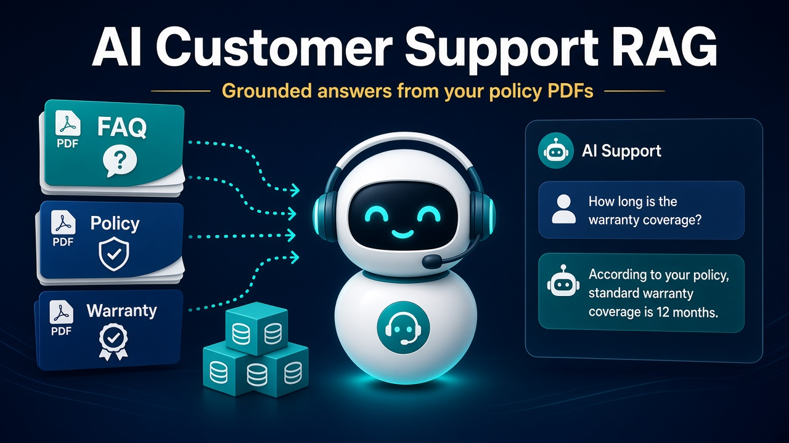
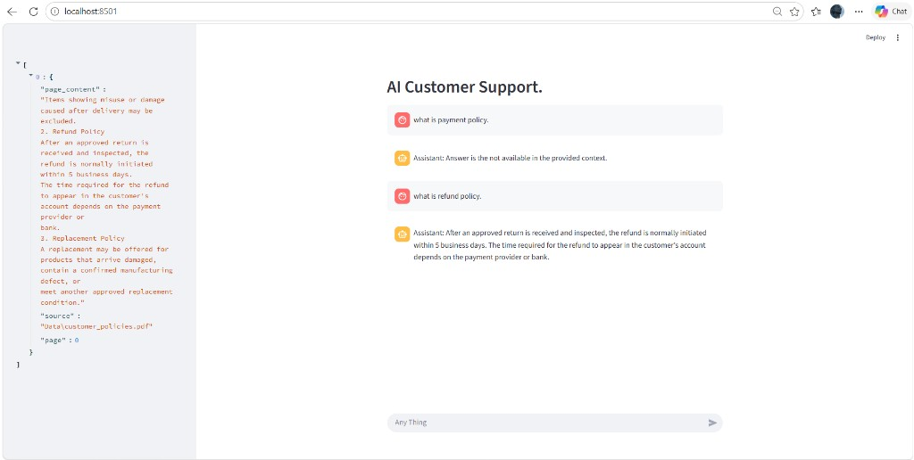

<h1 align="center">🛃 AI Customer Support RAG</h1>

<p align="center">
  <b>Policy-aware customer support answers, grounded in your own PDFs.</b>
  <br />
  Ask about payments, refunds, warranty, or products — the assistant retrieves the matching policy chunk and answers only from that context.
</p>

<p align="center">
  
  
  
  
  
</p>

---

## ✨ What this project does

This is a **Retrieval-Augmented Generation (RAG)** demo for customer support.

1. 📄 Load company PDFs (policies, FAQ, warranty, product guide)
2. ✂️ Split them into overlapping chunks
3. 🔢 Embed chunks with `all-MiniLM-L6-v2`
4. 🗄️ Store vectors in **ChromaDB**
5. 🔎 Retrieve the top matching chunks for a user question
6. 🤖 Generate a short answer with **Qwen2.5-3B-Instruct** — **only from retrieved text**

If the answer is not in the documents, the model is instructed to say:

> Answer is the not available in the provided context

---

## 🖼️ Live output

The Streamlit chat UI on `localhost:8501`. The left sidebar shows the retrieved chunk (source PDF + page). The main pane is the conversation.

<p align="center">
  
</p>

**What the screenshot shows**

| Question | Result |
| --- | --- |
| `what is payment policy.` | No matching payment section in the retrieved chunk → honest “not in context” reply |
| `what is refund policy.` | Refund rules retrieved from `customer_policies.pdf` and answered from that text |

---

## 🏗️ Architecture

```text
User question
     │
     ▼
┌─────────────┐     ┌──────────────┐     ┌─────────────┐
│  Retrieval  │────▶│   Prompt     │────▶│     LLM     │
│  (Chroma)   │     │  + context   │     │  Qwen 2.5   │
└─────────────┘     └──────────────┘     └─────────────┘
     ▲
     │
┌─────────────┐     ┌──────────────┐     ┌─────────────┐
│   PDFs in   │────▶│  Chunking    │────▶│ Embeddings  │
│   /Data     │     │  500 / 300   │     │ MiniLM-L6   │
└─────────────┘     └──────────────┘     └─────────────┘
```

---

## 📁 Project structure

```text
AI-Customer-Support-RAG/
├── assets/
│   ├── project-thumbnail.jpg   # repo cover / thumbnail
│   └── app-output.png          # real app screenshot
├── Data/
│   ├── customer_policies.pdf
│   ├── customer_faq .pdf
│   ├── product_guide.pdf
│   └── warranty_policy.pdf
├── Modules/
│   ├── app.py                  # Streamlit chat UI
│   ├── config.py               # paths, models, chunk settings
│   ├── indexing.py             # PDF load → split → embed → Chroma
│   ├── retrieval.py            # top-k document search
│   ├── prompt.py               # grounded RAG prompt
│   └── LLM.py                  # local Hugging Face generation
├── chroma_db/                  # persisted vector store
├── OVERVIEW.md                 # one-page project brief
├── requirements.txt
└── README.md
```

---

## ⚙️ Configuration

All knobs live in `Modules/config.py`:

| Setting | Value | Role |
| --- | --- | --- |
| `DATA_PATH` | `Data` | Folder of policy PDFs |
| `CHUNK_SIZE` | `500` | Characters per chunk |
| `CHUNK_OVERLAP` | `300` | Overlap so policies are not split mid-rule |
| `EMBEDDING_MODEL` | `sentence-transformers/all-MiniLM-L6-v2` | Local embeddings |
| `CHROMA_PATH` | `chroma_db` | Vector database folder |
| `COLLECTION_NAME` | `customer_support` | Chroma collection |
| `TOP_K` | `3` | Chunks retrieved per question |
| `LLM_MODEL` | `Qwen/Qwen2.5-3B-Instruct` | Local instruction model |

No API key is required. Models download from Hugging Face on first run.

---

## 🚀 Getting started

### 1. Clone and enter the repo

```bash
git clone https://github.com/<your-username>/AI-Customer-Support-RAG.git
cd AI-Customer-Support-RAG
```

### 2. Create a virtual environment

```bash
python -m venv .venv
# Windows
.venv\Scripts\activate
# macOS / Linux
source .venv/bin/activate
```

### 3. Install dependencies

```bash
pip install -r requirements.txt
```

### 4. Run the app from the project root

Indexing looks for `Data/` relative to the working directory, so start Streamlit from the repo root:

```bash
streamlit run Modules/app.py
```

Open **http://localhost:8501** and type a question in the chat box.

---

## 💬 Try these questions

| Try this | Why |
| --- | --- |
| `what is refund policy.` | Hits `customer_policies.pdf` |
| `what is payment policy.` | Often out of the retrieved window — shows grounded refusal |
| `What is the warranty period?` | Uses `warranty_policy.pdf` |
| `How do I use the product?` | Uses `product_guide.pdf` |

---

## 🧩 Module map

| File | Responsibility |
| --- | --- |
| `app.py` | Chat history, sidebar retrieved docs, Streamlit layout |
| `indexing.py` | Cached PDF ingest + Chroma persist |
| `retrieval.py` | Convert a question into ranked chunks + source/page |
| `prompt.py` | Force answers to stay inside retrieved context |
| `LLM.py` | Cached Hugging Face text-generation pipeline |

---

## 🧠 Design rules (product)

- ✅ Answer **only** from retrieved policy text
- ✅ Keep replies **short and structured**
- ✅ Admit when the context does not contain the answer
- ❌ Do not invent payment, refund, or warranty terms

---

## 🛠️ Tech stack

- **UI:** Streamlit
- **Orchestration:** LangChain
- **Loaders:** PyPDF
- **Embeddings:** Sentence Transformers (MiniLM)
- **Vector store:** ChromaDB
- **Generator:** Transformers → Qwen2.5-3B-Instruct

---

## 📌 Notes

- First launch downloads embedding + LLM weights — that can take several minutes and needs disk space.
- `indexing_file()` is cached with `@st.cache_resource`, so PDFs are indexed once per session.
- Replace files in `Data/` with your own policies, then restart the app (clear Streamlit cache if old chunks remain).

---

<p align="center">
  Built as a hands-on RAG practice project for grounded customer-support Q&amp;A.
</p>
